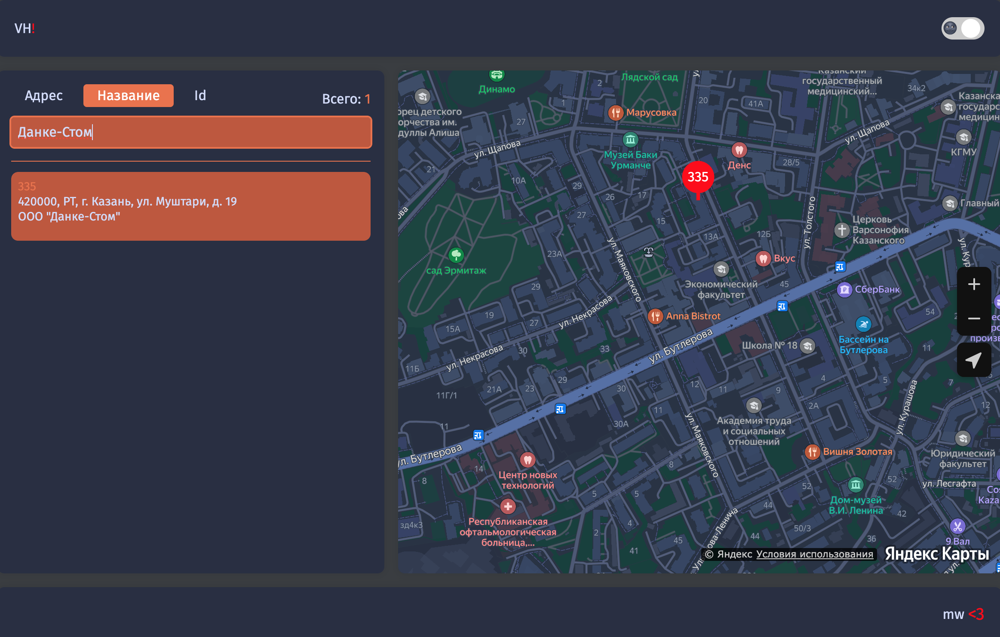
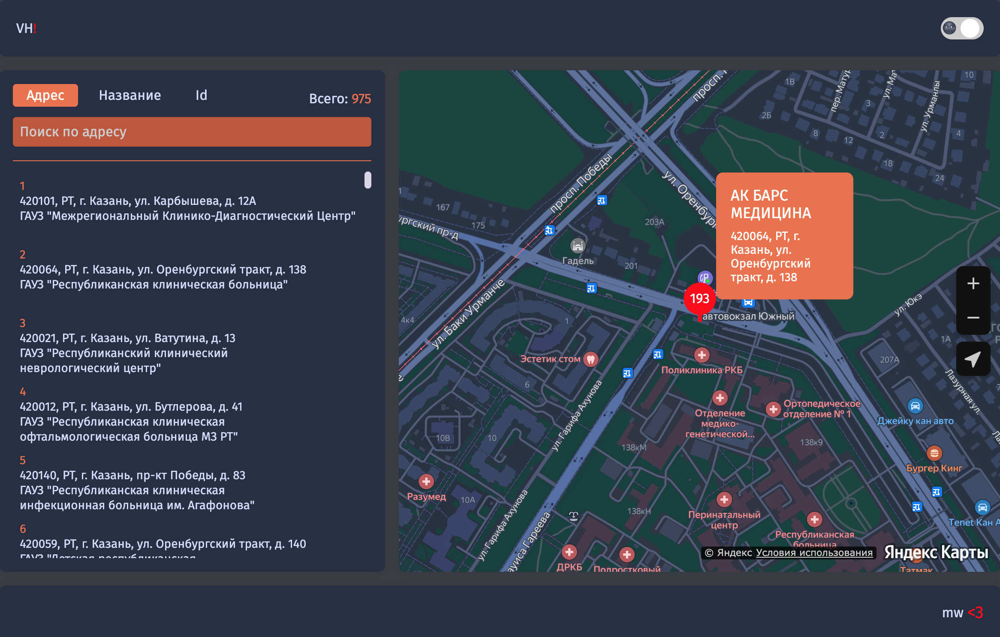

## 🖼 Скриншоты

---

### Описание:

DMS - это веб-приложение, разработанное для предоставления пользователям интуитивно понятного интерфейса для визуализации всех близлежащих клиник на карте. Независимо от того, обращаетесь ли вы за медицинской помощью или просто хотите изучить варианты медицинского обслуживания в вашем регионе, DMS предлагает удобное решение.

### Основные характеристики:

- Интерактивная карта: Используя современные картографические технологии, DMS отображает все клиники поблизости, что позволяет пользователям легко ориентироваться.
- Функция поиска: Пользователи могут искать конкретные клиники по названию или местоположению, что упрощает процесс поиска соответствующих медицинских услуг.
- Удобный интерфейс: Приложение может похвастаться чистым и интуитивно понятным интерфейсом, обеспечивающим удобную навигацию для пользователей с любым уровнем опыта.

### Используемые технологии:

- Интерфейс: HTML5, CSS3, TypeScript, React.
- Картографический API: интеграция с картографическими сервисами Yandex API для отображения интерфейса карты и взаимодействия с ним.

### Лицензия:

Этот проект лицензирован по лицензии MIT. Не стесняйтесь изменять и распространять код для личного или коммерческого использования.

### Отказ от ответственности:

DMS - это персональный проект, разработанный в образовательных и демонстрационных целях. Несмотря на то, что были предприняты усилия для обеспечения точности и достоверности предоставляемой информации, мы рекомендуем пользователям проверять детали непосредственно в соответствующих клиниках, прежде чем принимать какие-либо решения или записываться на прием.
